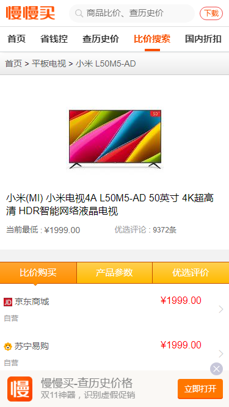

# 仿[慢慢买](m.manmanbuy.com)H5

### 技术栈

- 媒体查询 + rem布局
- ajax + 前端渲染(art-template)
- less预编译

### 项目截图

|  |  |  |
| ----------------------------- | ----------------------------- | ----------------------------- |
|  |  |  |

#### rem 单位如何转换为像素值

当使用 rem 单位，他们转化为像素大小取决于页面根元素的字体大小，即 html 元素的字体大小。 根元素字体大小乘以你 rem 值。

例如，根元素的字体大小 16px，10rem 将等同于 160px，即 10 x 16 = 160。

#### em 单位如何转换为像素值

当使用em单位时，像素值将是em值乘以使用em单位的元素的字体大小。

#### em 单位的遗传效果

使用 em 单位存在继承的时候，情况会变得比较棘手，因为每个元素将自动继承其父元素的字体大小。 继承效果只能被明确的字体单位覆盖，比如px,vw。

使用 em 单位的元素字体大小根据它们来定。 但该元素可能继承其父元素的字体大小，而父元素又继承其父元素的字体大小，等等。 因此，以 em 为单位的元素字体大小可能会受到其任何父元素的字体大小影响。

#### 重点理解:

有一个比较普遍的误解，认为 em 单位是相对于父元素的字体大小。 事实上，根据W3标准 ，它们是相对于使用em单位的元素的字体大小。父元素的字体大小可以影响 em 值，但这种情况的发生，纯粹是因为继承。